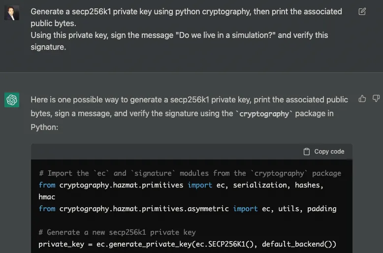
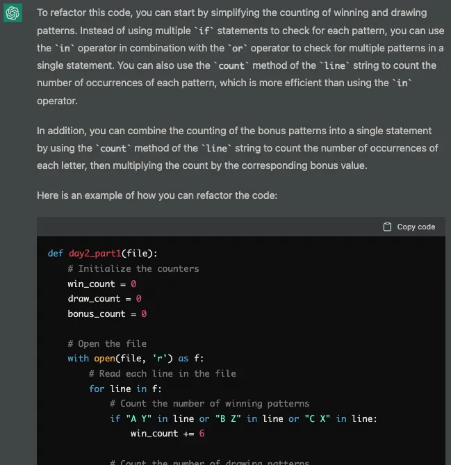

The signs are clear.

Chocolate ads are taking over, Mariah Carey is once again the queen of radio stations, I have about a dozen gifts to buy before the week-end, …

🎄Christmas is back!

For the last few years this has meant trying to solve as many [Advent of Code](https://adventofcode.com/2022) problems as possible: The core idea is to put your dev skills at the service of little elves in order to save Christmas. That’s a great purpose in life if you ask me.

Now I usually go at these problems conscientiously, until they become too complex for the 30min I am willing to spend on them every day. It usually means that I am done by day 4.

This year, I started with the firm intention to go to day 10, and to solve all the problems in Swift. This strong resolution lasted no more than 1 day, as a cool new toy caught my eye: [OpenAI’s new chat based on GPT-3](https://chat.openai.com/) 🤩

## Welcoming our AI overlords

In essence, ChatGPT is a chat bot based on [GPT-3](https://en.wikipedia.org/wiki/GPT-3), that has been trained with enormous amount of public data. It has been heavily talked about for more than a year now, and its applications are hinting at a future where sustainability of creative work may be called into question.

But that’s a problem for future us. For now let’s have fun, shall we?

After fiddling for an hour with ChatGPT, it was clear how useful it could be at least as a StackOverflow super search: Simple prompts would return great results for simple tasks in most languages.

Say you wanted to generate a private key and sign some message with in python.

Go on, just say it.



The answer is sharp, clear, and more importantly the code is absolutely correct. While it is “only” about retrieving the right parts of [python-cryptography’s documentation](https://cryptography.io/en/latest/), it is still a whole lot faster than having to go through the doc myself.

Here is the full code that was generated, with comments, so already much better than most of us devs out there.

```python
# Import the `ec` and `signature` modules from the `cryptography` package
from cryptography.hazmat.primitives import ec, serialization, hashes, hmac
from cryptography.hazmat.primitives.asymmetric import ec, utils, padding

# Generate a new secp256k1 private key
private_key = ec.generate_private_key(ec.SECP256K1(), default_backend())

# Get the public key associated with the private key
public_key = private_key.public_key()

# Serialize the public key in binary format
public_bytes = public_key.public_bytes(
    encoding=serialization.Encoding.DER,
    format=serialization.PublicFormat.SubjectPublicKeyInfo
)

# Print the public key in hexadecimal format
print(public_bytes.hex())

# Define the message to sign
message = "Do we live in a simulation?"

# Compute the message digest
digest = hashes.Hash(hashes.SHA256(), backend=default_backend())
digest.update(message)
msg_digest = digest.finalize()

# Sign the message digest using the private key
signature = private_key.sign(
    msg_digest,
    ec.ECDSA(hashes.SHA256())
)

# Verify the signature using the public key
public_key.verify(
    signature,
    msg_digest,
    ec.ECDSA(hashes.SHA256())
)
```

Now that’s what I call search on steroids!

ChatGPT can do much more than just simple code or advanced search. People on Twitter are trying to push it to its limit with great results so far. [But the best thing to do is to try it yourself.](https://chat.openai.com/chat)

## Coding with ChatGPT

What I am aiming to do though, is to produce novel code using ChatGPT. And no I won’t go here into the debate around what is novel, and what is creation.

In any case, I defined the following goals for this session:

1. Get ChatGPT to generate at least one valid solution
2. Simplify the prompt as much as possible
3. Do as little dev work on my side as possible

Before we move on to the actual problem, there’s a couple things to understand about the prompt.

## Talk Prompt-ly to me

The prompt is this extensible text field through which you interact with ChatGPT.

Unlike most other search engines, you’re encouraged to use natural language to make your queries. Successive prompts constitute a session, and ChatGPT will remember the context between prompts.


Here, after asking for an example of an Ethereum transaction, I referenced the `gasPrice` from the data structure that I got in return. ChatGPT understood the link between the two prompt, and happily obliged my request.

*Note that this example also shows limits of ChatGPT: The ETH amount of the transaction is wrong in the transaction. Always remember that this is a tool, an apply critical thinking to its answers.*

Tweaking your wording, reorganising your sentences, and clarifying your meaning can all improve the answers you get from this AI.

Now, let’s get back to **Advent of Code**, we’ve got a holiday to save after all!

## At the service of the Elves

In short, [today’s prompt (Day 2)](https://adventofcode.com/2022/day/2), is about figuring out the result of thousands of Rock-Paper-Scissor games you’re playing with the Elves. Each outcome will grant you different number of points, and each of the 3 options gives you a bonus when played.

After some trial and errors, I came up with the following request:

```
Write python code that reads a file line by line, then 
counts how many times the following patterns are found:

- Winning patterns, that count as six points: "A Y", "B Z", "C X"
- Drawing patterns, that count as three points: "A X", "B Y", "C Z"

In addition we should add the following bonus per line:
- if "X" is found in a line, we should add one point
- if "Y" is found in a line, we should add two points
- if "Z" is found in a line, we should add three points

We'll call the sum of all these counters "result".

Wrap the whole code in a function called day2_part1 that
returns "result", and print this result.
```

In the future, I’ll make sure to describe the process of writing the prompt, but I feel like this article is already long enough as is.

Now, the first working output I got for this prompt was the following:

```python
def day2_part1(file):
    # Define the counters
    winning_patterns = 0
    drawing_patterns = 0
    x_bonus = 0
    y_bonus = 0
    z_bonus = 0
    
    # Open the file
    with open(file, 'r') as f:
        # Read each line in the file
        for line in f:
            # Check for winning patterns
            if "A Y" in line:
                winning_patterns += 6
            elif "B Z" in line:
                winning_patterns += 6
            elif "C X" in line:
                winning_patterns += 6
                
            # Check for drawing patterns
            if "A X" in line:
                drawing_patterns += 3
            elif "B Y" in line:
                drawing_patterns += 3
            elif "C Z" in line:
                drawing_patterns += 3
                
            # Check for X bonus
            if "X" in line:
                x_bonus += 1
                
            # Check for Y bonus
            if "Y" in line:
                y_bonus += 2
                
            # Check for Z bonus
            if "Z" in line:
                z_bonus += 3
    
    # Calculate the result
    result = winning_patterns + drawing_patterns + x_bonus + y_bonus + z_bonus
    
    # Return the result
    return result
```

It’s… okay.

The result is definitely correct, it’s functional, but also quite ugly. Any dev reading this would probably feel the urge to refactor it. So let’s ask ChatGPT to do just that!



10/10, would hire.

## Random luck

One thing to know about ChatGPT is that outputs are dependant on the prompt, the session context, and a **random seed generated per session.**

I learned about this when trying to reproduce the result above with the same initial prompt, but instead I immediately got the following response:

```python
def day2_part1():
  # Open the file
  with open("file.txt") as f:
    # Initialize the counters
    win_count = 0
    draw_count = 0
    bonus_count = 0

    # Read the file line by line
    for line in f:
      # Count the number of winning patterns
      win_count += line.count("A Y") + line.count("B Z") + line.count("C X")

      # Count the number of drawing patterns
      draw_count += line.count("A X") + line.count("B Y") + line.count("C Z")

      # Count the number of bonus patterns
      bonus_count += line.count("X") + line.count("Y") * 2 + line.count("Z") * 3

    # Calculate the result
    result = win_count * 6 + draw_count * 3 + bonus_count

  # Return the result
  return result
```

Now that’s a nice looking function, you’ve earned your star ChatGPT 🌟!

## Simpler is better

As I was writing this article, I realised I had somewhat forgotten one of my requirements: Simplify the prompt as much as possible.

Indeed, why bother with tweaking the input when I could just copy paste the initial problem statement?

What I got back was a great textual explanation, which in itself can be very useful to help summarise and understand problem statements. But we don’t care about that here, we want code, so let’s ask for it!

I came up with the these two prompts as follow ups:

> Can you write python code to solve this problem?
> Can you modify this code to read the “strategy_guide” from each line of a file, and wrap the whole code in a function called day2_part1 that returns the total_score?

```python
def day2_part1(strategy_guide_file):
    # Define the scoring rules for the game
    SCORES = {
        "R": 1,  # Score for Rock
        "P": 2,  # Score for Paper
        "S": 3,  # Score for Scissors
        "L": 0,  # Score for a loss
        "D": 3,  # Score for a draw
        "W": 6,  # Score for a win
    }

    # Define the rules for the game
    RULES = {
        "R": {"S": "W", "P": "L"},  # Rock vs Scissors: Rock wins, Rock vs Paper: Rock loses
        "P": {"R": "W", "S": "L"},  # Paper vs Rock: Paper wins, Paper vs Scissors: Paper loses
        "S": {"P": "W", "R": "L"},  # Scissors vs Paper: Scissors wins, Scissors vs Rock: Scissors loses
    }

    # Initialize the total score to 0
    total_score = 0

    # Loop over the rounds in the strategy guide
    for line in strategy_guide_file:
        # Get the opponent's move and the player's move
        opponent_move, player_move = line.split()

        # If the opponent's move and the player's move are the same, the round ends in a draw
        if opponent_move == player_move:
            outcome = "D"

        # Otherwise, use the rules of the game to determine the outcome of the round
        else:
            outcome = RULES[opponent_move][player_move]

        # Calculate the score for the round and add it to the total score
        round_score = SCORES[opponent_move] + SCORES[outcome]
        total_score += round_score

    # Return the total score
    return total_score

# Read the strategy guide file
with open("strategy_guide.txt") as f:
    # Calculate the total score
    total_score = day2_part1(f)

    # Print the total score
    print(total_score)
```

The result looks pretty good!

But it does not work, as the characters used to represent Rock, Paper, and Scissors are incorrect. Oh well, we tried, and I have long exceeded my half-hour quota.

## What next?

Although it took me longer to solve this problem with ChatGPT than if I were to do it by hand, that was mostly due to ramping up on this great tool. The next few days will hopefully be easier to deal with.

For future prompts, I will probably adopt the last strategy I tried: Copy paste the statement and improve the result from there.

If like me you’re excited to see how it unfolds, [check out part 2!](/blog/advent-of-ai-code)