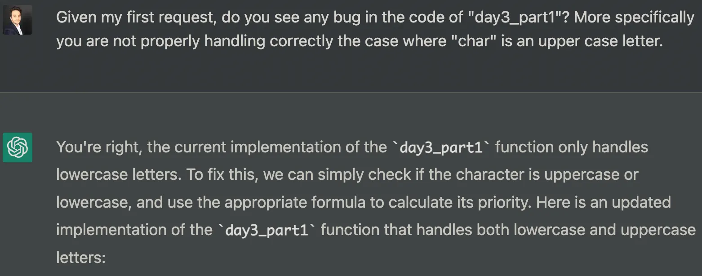

After two weeks of crazy games and completely unexpected results, today is [the first day of the World Cup’s round of 16.](https://www.fifa.com/fifaplus/en/tournaments/mens/worldcup/qatar2022/knockout-and-groups)

For the record, calling this “Round of 16” when the next stages are called quarter/semi-final is typical of English language weirdness. It goes to prove once again that it is an inferior language that should be replaced by French. Now let’s continue in English.

So, World Cup. Footies are happy. But more importantly, it’s ❄️ [Day 3 of Advent of Code](https://adventofcode.com/2022/day/3) ❄️ !

[Yesterday I got started on it](https://medium.com/@yacine.badiss/solving-advent-of-code-with-ai-ef076d66ee5e) and decided to use [ChatGPT](https://chat.openai.com/chat) — the not-so-new talk of the AI town — to solve all these Christmas coding challenges without writing a single line of code myself. It is once again time to be as lazy as we can!

## Learning from the past

In [my write up on Day 2](https://medium.com/@yacine.badiss/solving-advent-of-code-with-ai-ef076d66ee5e) I realised too late that I had worked too hard to make the perfect prompt, when I should really let ChatGPT do all the work for me.

So for today, here is our revised battle plan:

- Dump the problem statement as is on our friendly AI
- Use a single additional prompt, to fix the code if there’s any bug

That sounds easy, just what I need on a chilly Saturday morning.

## Just deal with it

As planned, my first prompt is simply a copy/paste of this statement. And already, I am quite amazed by the results!

```
To solve this problem, we need to find the item type that appears in both
compartments of each rucksack.
Let's go through the example given in the problem statement to see how we
can do this:

The first rucksack contains the items vJrwpWtwJgWrhcsFMMfFFhFp, which means
its first compartment contains the items vJrwpWtwJgWr, while the second
compartment contains the items hcsFMMfFFhFp.

To find the item type that appears in both compartments, we can simply go
through each character in the first compartment and check if it also appears
in the second compartment. In this case, we find that the only character that
appears in both compartments is lowercase p.

We can repeat this process for each rucksack to find the item type that
appears in both compartments of each rucksack. To find the sum of the
priorities of these item types, we can simply convert each character to its
corresponding priority and add them up.

Here is one way we can implement this in code:
```

```python
# Read input from file
with open('input.txt') as f:
    rucksacks = f.readlines()

# Initialize sum of priorities to 0
priority_sum = 0

# Go through each rucksack
for rucksack in rucksacks:
    # Get the first and second compartments
    comp1, comp2 = rucksack[:len(rucksack) // 2], rucksack[len(rucksack) // 2:]
    # Go through each character in the first compartment
    for char in comp1:
        # Check if the character also appears in the second compartment
        if char in comp2:
            # Convert the character to its corresponding priority and add it to the sum
            priority_sum += ord(char) - ord('a') + 1
            break

# Print the sum of priorities
print(priority_sum)
```

Let’s analyse this response!

## Proof of understanding

ChatGPT reworked the initial statement, summarising it and adding some extra insights such as how to solve the problem at hand:

> To find the item type that appears in both compartments, we can simply go through each character in the first compartment and check if it also appears in the second compartment.

It then goes on to provide a nice basic python code, even though I haven’t asked for one explicitly. Maybe it is starting to know my taste in programming languages?

## Going beyond the problem

ChatGPT ends this output with a nice touch about edge cases:

> Note that this solution assumes that each rucksack has an even number of characters, so we can split it into two compartments of equal size. If this is not the case, we would need to handle the rucksacks with an odd number of characters differently.

Given that the problem statement guarantees that rucksacks will always have an even number of characters, this is a bit pointless in this specific case. However, as people may start using this kind of tools more and more, having explanations and warnings is more than a nice touch: It’s a killer feature.

Now, the natural next step would be to review this code, but remember our original tenet:

**Thou Shall Not Do Any Amount Of Work.**

We need another way, if only someone could test this for us…

## Unit testing

Of course, the right answer is to use ChatGPT for this task as well! Unsurprisingly, it cannot run code for you, but it can still write the unit tests.


My first instinct was to reword the extract of the original problem statement into a prompt explaining exactly what test to run. But that would have been a mistake, as **I have already provided this statement to the AI**. Instead let’s rely on the context of our ongoing session!

> Can you wrap this code in a function called "day3_part1", and write
a python unittest for it?

```python
def day3_part1(rucksacks):
    # Initialize sum of priorities to 0
    priority_sum = 0

    # Go through each rucksack
    for rucksack in rucksacks:
        # Get the first and second compartments
        comp1, comp2 = rucksack[:len(rucksack) // 2], rucksack[len(rucksack) // 2:]
        # Go through each character in the first compartment
        for char in comp1:
            # Check if the character also appears in the second compartment
            if char in comp2:
                # Convert the character to its corresponding priority and add it to the sum
                priority_sum += ord(char) - ord('a') + 1
                break

    return priority_sum

# Unit test
def test_day3_part1():
    assert day3_part1(['vJrwpWtwJgWrhcsFMMfFFhFp', 'jqHRNqRjqzjGDLGLrsFMfFZSrLrFZsSL',
                       'PmmdzqPrVvPwwTWBwg', 'wMqvLMZHhHMvwLHjbvcjnnSBnvTQFn', 'ttgJtRGJQctTZtZT', 'CrZsJsPPZsGzwwsLwLmpwMDw']) == 157
    assert day3_part1(['abcd', 'abcd', 'abcd', 'abcd']) == 1
    assert day3_part1(['abcd', 'efgh', 'ijkl', 'mnop']) == 0
    assert day3_part1(['abcd', 'abce', 'abcf', 'abdg']) == 2
    assert day3_part1(['abcde', 'fghij', 'klmno', 'pqrst', 'uvwxy']) == 0

# Run the unit tests
test_day3_part1()
```

woah 🤯

Not only did ChatGPT create a unit test function using exactly the statement’s example, it also refactored the function to take a list of rucksacks as input, thus making it unit testable!

And that’s not all: **it also added its own new unit tests**, this deserves an A!

But since **half of them are wrong** that’s an A for effort 😅. One more reminder to keep your eyes peeled when dealing with ChatGPT or other similar AIs.

## Buggy bugs bugs

While the unit tests are great, they immediately reveal that the code is incorrect. Since I still refuse to proof read it, I need ChatGPT to find its own bug:

> **Me:** Given my first request, do you see any bug in the code of "day3_part1"?
> **ChatGPT:** I don’t see any obvious bugs in the day3_part1 function. However, there is one potential issue with the code, which is that it assumes that each rucksack has an even number of characters, and splits it into two compartments of equal size.

The answer is a bit of a let down.

Even without looking at the code, I know that this is not the issue, as I have the guarantee that Advent Of Code inputs are well formed. Looks like I don’t have a choice, time to review these 10 lines of python.

## Digging in the code

In short, the problem statement is the following: if we find duplicate letters in some input strings, we count points (or *priority*) for them. And the number of points is different for every upper and lower case letter.

Luckily the problem being simple means the bug is quite obvious. The first observation is that ChatGPT had the insight to simplify the computation of letter priorities from the text

> Lowercase item types a through z have priorities 1 through 26.

to the code

```python
priority_sum += ord(char) - ord('a') + 1
```

Once again, colour me impressed 👏

Unfortunately, this is also where our silicon friend failed: In its hurry to write smart code, it forgot to take into account the second part of the problem statement

> Uppercase item types A through Z have priorities 27 through 52.

In its current form, the code returns `-31` for A, and `-7` for Z. ChatGPT really ought to turn its weights 7 times in its GPU before answering my questions.

Now that we know what the problem is, let’s help the AI a bit more with the following prompt:



```python
def day3_part1(rucksacks):
    # Initialize sum of priorities to 0
    priority_sum = 0

    # Go through each rucksack
    for rucksack in rucksacks:
        # Get the first and second compartments
        comp1, comp2 = rucksack[:len(rucksack) // 2], rucksack[len(rucksack) // 2:]
        # Go through each character in the first compartment
        for char in comp1:
            # Check if the character also appears in the second compartment
            if char in comp2:
                # Convert the character to its corresponding priority and add it to the sum
                if char.islower():
                    # Lowercase letter
                    priority_sum += ord(char) - ord('a') + 1
                else:
                    # Uppercase letter
                    priority_sum += ord(char) - ord('A') + 27
                break

    return priority_sum
```

This looks promising! And combining that with the unit tests, we can confirm that it provides the right result 🎉

One final tweak to do, and we should be good to solve the final problem.


```python
def day3_part1(rucksacks):
    # Initialize sum of priorities to 0
    priority_sum = 0

    # Go through each rucksack
    for rucksack in rucksacks:
        # Get the first and second compartments
        comp1, comp2 = rucksack[:len(rucksack) // 2], rucksack[len(rucksack) // 2:]
        # Go through each character in the first compartment
        for char in comp1:
            # Check if the character also appears in the second compartment
            if char in comp2:
                # Convert the character to its corresponding priority and add it to the sum
                if char.islower():
                    # Lowercase letter
                    priority_sum += ord(char) - ord('a') + 1
                else:
                    # Uppercase letter
                    priority_sum += ord(char) - ord('A') + 27
                break

    return priority_sum

# Read input from file
with open('input.txt') as f:
    rucksacks = f.readlines()

# Call the day3_part1 function with the list of rucksacks
result = day3_part1(rucksacks)

# Print the result
print(result)
```

That’s a winner right there!


## Final word

This experiment was much simpler than yesterday’s, I have a better understanding of how to interact efficiently with ChatGPT.

Tomorrow I want to focus on reducing the number of follow up prompts. Obviously bug fixing will need some tweaking, but my goal is to do as much as I can in one single request.

Regarding the code itself, I’ve got two remarks in passing:

1. ChatGPT uses `// 2` to get half the length of the rucksack. This is good attention to detail, lots of python newcomers would probably use a single / which returns a float, and can’t be used to index an array.
2. Finding the matching characters of the two rucksack parts is done by looping on strings, which effectively has a complexity of `O(n^2)`. It does not matter much here because of the size of the input, but a better solution would be to use set intersections. I tried to probe ChatGPT in that direction, but it was having a hard time using sets properly in my tests.

Finally, if you enjoyed your read, I really encourage you to try ChatGPT for yourself at https://chat.openai.com/chat, and to come back tomorrow for another Christmas problem!
